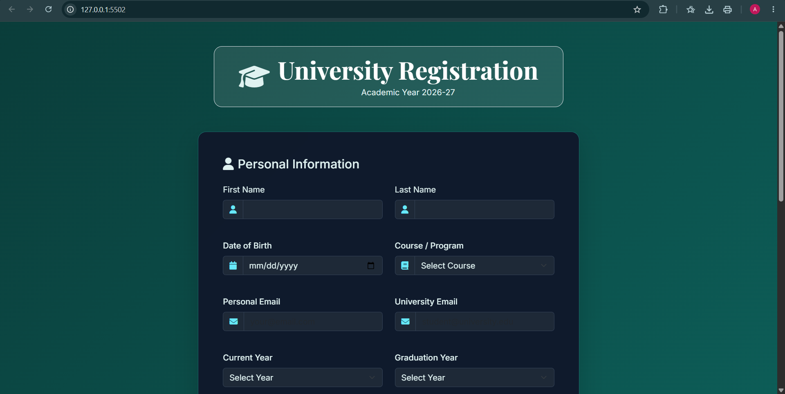
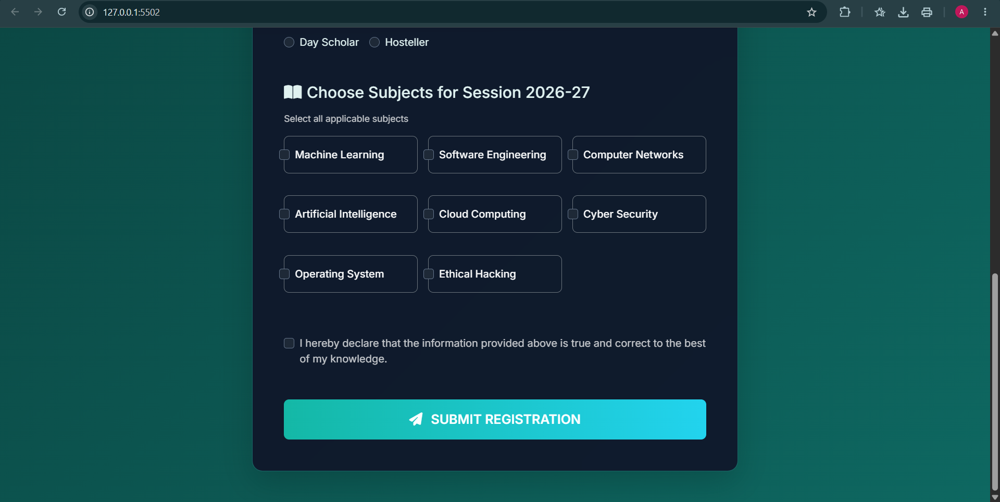
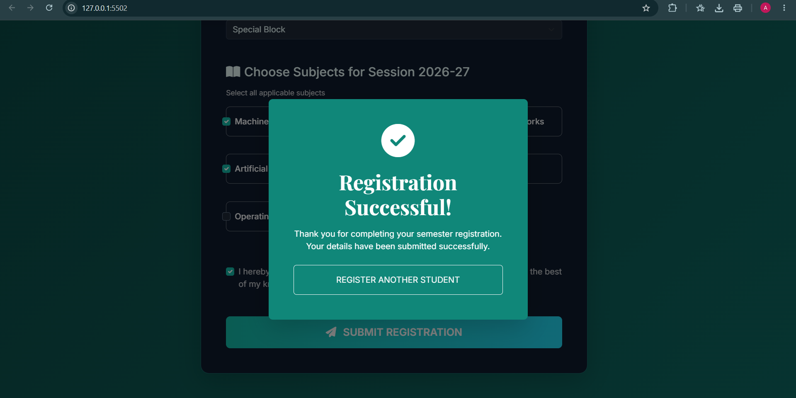

<div align="center">

# 🎓 University Student Registration System

### *A Modern Full-Stack Student Registration Portal*

A responsive university registration platform built with modern web technologies, featuring real-time validation, secure REST APIs, and PostgreSQL database integration.

<p>


</p>

---

## 🚀 Tech Stack

<p align="center">


</p>

---

### ✨ Features

</div>

* 🎓 Student Registration Portal
* 📱 Fully Responsive Interface
* 📝 Comprehensive Registration Form
* ⚡ Real-Time Form Validation
* 🎯 Dynamic Subject Selection
* 🏠 Hostel & Residence Management
* 🎓 Course & Academic Information
* 🔒 REST API Integration
* 🗄 PostgreSQL Database Storage
* 🎨 Modern UI
* 🌙 Smooth Animations

---

# 🏗 Architecture

```text
                    👨‍🎓 Student
                         │
                         ▼
         ┌────────────────────────────┐
         │     HTML • CSS • JS UI     │
         │   Responsive Registration  │
         └────────────────────────────┘
                         │
                Form Validation
                         │
                         ▼
                  Fetch API (JSON)
                         │
                         ▼
         ┌────────────────────────────┐
         │     Node.js + Express      │
         │        REST API            │
         └────────────────────────────┘
                         │
                  SQL Queries
                         │
                         ▼
         ┌────────────────────────────┐
         │       PostgreSQL DB        │
         │ Student Records & Storage  │
         └────────────────────────────┘
```

---

# 🗄 Database Schema

```text
student
│
├── 🆔 id
├── 👤 first_name
├── 👤 last_name
├── 🎂 dob
├── 📧 personal_email
├── 🎓 university_email
├── 📚 course
├── 🏫 current_year
├── 🎓 graduation_year
├── 🏠 residence_type
├── 🛏 hostel_block
├── 📖 subjects
└── 📅 created_at
```

---

# 🔄 Registration Workflow

```text
🖥 Open Website
      │
      ▼
📝 Fill Registration Form
      │
      ▼
✅ Client-side Validation
      │
      ▼
📤 Send Request to REST API
      │
      ▼
🛡 Server-side Validation
      │
      ▼
🗄 PostgreSQL Database
      │
      ▼
🎉 Registration Successful
```

---

# 💻 Tech Highlights

| Category    | Technologies                                |
| ----------- | ------------------------------------------- |
| 🌐 Frontend | HTML5, CSS3, JavaScript                     |
| ⚙ Backend   | Node.js, Express.js                         |
| 🗄 Database | PostgreSQL                                  |
| 🔌 API      | REST API, Fetch API                         |
| 🛠 Tools    | VS Code, Git, GitHub, npm, pgAdmin, Postman |

---


#📷 Screenshots

<p align="center">
  
</p>

<p align="center">
  
</p>

<p align="center">
  
</p>


---

<div align="center">

### ⭐ If you found this project useful, consider giving it a star!

**Made with ❤️ using HTML, CSS, JavaScript, Node.js, Express & PostgreSQL**

</div>
